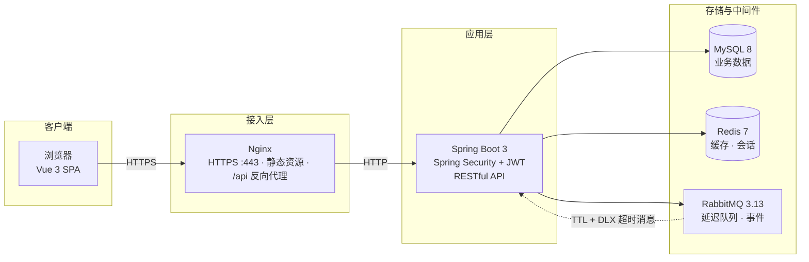

<div align="center">

# 校园二手交易平台

**基于 Spring Boot 3 与 Vue 3 的前后端分离校园 C2C 交易系统**


</div>

---

## 1. 项目简介

面向高校场景的 C2C 二手交易平台，覆盖 **商品发布 → 搜索浏览 → 在线下单 → 模拟支付 → 发货收货 → 评价反馈** 的完整交易闭环，并提供独立的**管理后台**（用户治理、商品审核、订单监管、经营统计）。

## 2. 系统架构



- **交易链路**：前端预生成订单号下单 → MQ 延迟消息（TTL+死信）排队超时检查 → 支付回调验签改状态
- **兜底机制**：定时任务每 30s 扫描超时未支付订单，与 MQ 消费者共用同一取消逻辑，保证最终一致

## 3. 技术栈

| 层次 | 技术选型 |
|---|---|
| 后端 | JDK 17 · Spring Boot 3.3 · Spring Security + JWT · MyBatis-Plus 3.5 · Knife4j · Hutool |
| 数据 | MySQL 8.0（InnoDB · utf8mb4） |
| 缓存 | Redis 7（Spring Data Redis + Lettuce 连接池） |
| 消息 | RabbitMQ 3.13（TTL + 死信交换机延迟队列、Fanout 支付事件） |
| 前端 | Vue 3.5（组合式 API）· Vite 5 · Element Plus · Pinia · Vue Router · Axios · ECharts |
| 部署 | Docker Compose（5 容器编排）· Nginx（HTTPS / HTTP2 · 反向代理 · gzip） |

## 4. 核心技术设计

### 4.1 缓存体系（Cache-Aside）

| 策略 | 实现 |
|---|---|
| 一致性 | **先更新数据库，再删除缓存**；列表缓存按 `product:list:*` 模式 SCAN 批量失效 |
| 防雪崩 | 详情缓存 TTL 30min + 随机抖动（0–5min），避免同一时刻集中过期 |
| 防穿透 | 不存在的商品缓存空值 60s，拦截恶意 ID 扫描 |
| 会话缓存 | JWT 认证用户信息缓存 1h，管理员禁用账号**即时生效**，未命中降级查库 |

### 4.2 下单幂等

```
前端 crypto.randomUUID() 预生成 clientOrderNo
        ↓
orders.order_no 唯一索引（数据库层最终防线）
        ↓
并发重复插入捕获 DuplicateKeyException → 返回已存在订单
```

### 4.3 订单超时取消（双保险）

```
下单成功 ──► RabbitMQ 延迟消息（TTL = 超时分钟数）
                │ TTL 到期，经死信交换机（DLX）路由至消费队列
                ▼
        cancelExpiredOrder()  ◄── @Scheduled 每 30s 扫表兜底
                │
                ▼
        CAS 条件更新：UPDATE orders SET status=4 WHERE id=? AND status=0
```

### 4.4 安全设计

- **认证**：Spring Security 无状态模式 + JWT（jjwt），过滤器链统一鉴权
- **授权**：`/admin/**` 角色隔离，越权访问返回 403
- **支付回调**：`sign = md5(orderNo | amount | salt)` 验签 + 金额比对 + 重复回调幂等
- **上传安全**：图片格式白名单（jpg/jpeg/png/gif/webp）、UUID 重命名、大小限制
- **规范**：统一响应体 `Result<T>`、全局异常处理、Jakarta Validator 参数校验

### 4.5 订单状态机

```
  ┌──────────┐  支付   ┌──────────┐  发货   ┌──────────┐  确认   ┌──────────┐
  │ 0 待付款 │ ──────► │ 1 待发货 │ ──────► │ 2 待收货 │ ──────► │ 3 已完成 │
  └──────────┘         └──────────┘         └──────────┘         └──────────┘
       │ 买/卖超时取消                 │ 卖家退款
       ▼                              ▼
  ┌──────────┐                  ┌──────────┐
  │ 4 已取消 │                  │ 5 已退款 │
  └──────────┘                  └──────────┘
```

所有状态流转均为 CAS 条件更新（`WHERE status = 期望旧值`），依据影响行数判定成功，杜绝并发下的非法流转。

## 5. 功能模块

**商城前台**：注册登录 · 分类浏览 · 关键词搜索 · 多维排序 · 商品详情（轮播/浏览计数）· 多图发布/编辑 · 上下架管理 · 收藏 · 购买下单（地址选择）· 模拟支付 · 发货/收货/退款 · 订单评价 · 个人中心（资料/头像/改密/地址簿）

**管理后台**：数据看板（用户/商品/订单/GMV + 近 7 日趋势图）· 用户管理（启用/禁用）· 商品审核与违规下架 · 订单监管 · 分类管理

## 6. 快速开始

### 6.1 环境要求

| 依赖 | 版本 |
|---|---|
| JDK | 17+ |
| Maven | 3.8+ |
| Node.js | 18+ |
| MySQL / Redis / RabbitMQ | 8.0 / 7.x / 3.13 |

### 6.2 本地开发启动

```powershell
# 1. 启动依赖服务（Windows 绿色版脚本，亦可使用自装服务）
powershell tools\env\start-mysql.ps1
powershell tools\env\start-redis.ps1
powershell tools\env\start-rabbitmq.ps1

# 2. 初始化数据库（自动建库建表 + 种子数据）
mysql -uroot -p < sql\init.sql

# 3. 启动后端（默认端口 8080，context-path=/api）
mvn -s tools\env\maven-settings.xml -f backend\pom.xml spring-boot:run

# 4. 启动前端（默认端口 5173，/api 与 /upload 自动代理至 8080）
cd frontend
npm install
npm run dev
```

启动完成后访问 <http://localhost:5173>（商城）· <http://localhost:8080/api/doc.html>（接口文档）。

### 6.3 Docker 一键部署

```bash
cd docker
cp .env.example .env        # 修改数据库/Redis/JWT 等密码为强密码
docker compose up -d --build
```

容器编排：`frontend`（Nginx 入口）→ `backend`（Spring Boot）→ `mysql` / `redis` / `rabbitmq`（仅容器内网，不暴露公网端口）。详细生产部署流程见 [docker/DEPLOY.md](docker/DEPLOY.md)。

## 7. 接口与测试

- **API 文档**：Knife4j 在线调试 <http://localhost:8080/api/doc.html>
- **自动化自测**：覆盖 登录鉴权、下单幂等、自购拦截、支付验签、全状态机流转、越权 403/未登录 401、MQ 超时取消 等 30 项断言

  ```powershell
  powershell -ExecutionPolicy Bypass -File tools\smoke-test.ps1                  # 全量（含 2 分钟超时实测）
  powershell -ExecutionPolicy Bypass -File tools\smoke-test.ps1 -SkipTimeoutTest # 快速模式
  ```

- **性能压测**：JMeter 脚本 `tools/jmeter/market-load-test.jmx`（50 并发 × 60s，覆盖商品列表 / 详情 / 登录核心链路），使用 JMeter 5.6 打开执行并查看聚合报告

## 8. 项目结构

```
xiaoyuanmarket/
├── backend/                     # Spring Boot 后端
│   └── src/main/java/com/xiaoyuan/market/
│       ├── common/              # 统一响应、全局异常、枚举
│       ├── config/              # Security · Redis · RabbitMQ · Web · Knife4j
│       ├── controller/          # REST 接口层（auth/user/product/order/...）
│       ├── service/             # 业务层（缓存、幂等、状态机实现）
│       ├── mq/                  # MQ 消费者（超时取消、支付通知）
│       ├── task/                # 定时任务（超时订单扫描兜底）
│       ├── security/            # JWT 过滤器
│       └── dto / entity / mapper / vo
├── frontend/                    # Vue 3 前端
│   └── src/
│       ├── views/mall/          # 商城前台页面
│       ├── views/admin/         # 管理后台页面
│       ├── layouts/             # 前台/后台布局（含移动端适配）
│       ├── api / stores / router / styles
├── sql/init.sql                 # 建库建表 + 种子数据（8 表）
├── docker/                      # docker-compose.yml · .env 模板 · 部署文档
├── tools/                       # 环境脚本 · 冒烟自测 · JMeter 压测 · 部署打包
└── README.md
```

## 9. 关键配置项

| 配置（`application.yml`） | 默认值 | 说明 |
|---|---|---|
| `market.order-timeout-minutes` | `2` | 订单超时取消时间（生产建议 15） |
| `market.pay-salt` | — | 支付回调验签盐（生产环境务必更换） |
| `market.upload-dir` | `./upload` | 商品图片存储目录 |
| `market.product-audit-enabled` | `false` | 开启后新商品需管理员审核后上架 |

## License

仅供学习交流使用。
